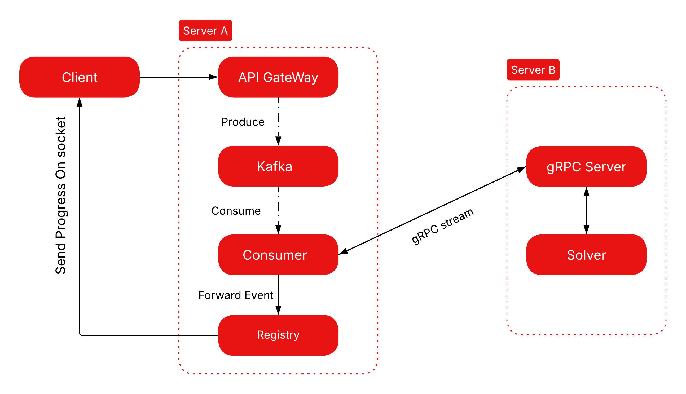

# Meridian

A distributed optimization gateway built as a hands-on exploration of distributed systems concepts — event-driven queues, gRPC streaming, and concurrent socket management in Go.

> Inspired by the **Distributed Systems** course taught by **Khaled Barbaria**.

---

## What it does

A client sends a Linear Programming problem over a raw TCP connection. The gateway queues it through Kafka, a background worker picks it up and forwards it to a gRPC solver on a second server, and the results stream back to the client in real time — without the gateway ever blocking on the computation.

The interesting part isn't the math. It's keeping the I/O layer decoupled from the compute layer so neither one starves the other.

## Architecture



**Server A** handles all client connections, queuing, and result routing.  
**Server B** runs the solver and streams progress events back.

## Project Structure

```
Meridian/
├── cmd/
│   ├── serverA/main.go       # Gateway entrypoint
│   └── serverB/main.go       # Solver entrypoint
├── internal/
│   ├── gateway/
│   │   ├── gateway.go        # TCP listener + connection lifecycle
│   │   └── worker.go        # Per-connection read/write loop
│   ├── queue/
│   │   └── consumer.go          # Kafka consumer
│   │   └── producer.go          # Kafka producer
│   ├── callbacks/
│   │   └── grpcCallback.go      # Bridges gRPC stream → client socket
│   ├── registry/
│   │   └── registry.go       # Thread-safe map of active connections
│   └── grpc/
│       ├── client/client.go  # gRPC streaming client
│       └── gen/solver/       # Generated protobuf stubs
```

## A Few Design Choices Worth Explaining

**Non-blocking accept loop** — each incoming TCP connection is handed off to a goroutine immediately, so the listener never stalls waiting on a slow client.

**Connection registry** — since Kafka processing is async, we need a way to route results back to the right socket. The registry is just a `struct` keyed by the session UUID assigned at connection time. Connections self-remove on disconnect via `defer`.

**Callback pipeline** — `callbacks.SendToGRPC` wires the Kafka consumer directly to the gRPC stream, then pipes updates into the registry's mailbox for that session. This keeps `main.go` clean and avoids global state.

## Current State

The networking infrastructure works end-to-end: TCP ingestion → Kafka → gRPC → streaming response → client.

What isn't done yet:

- **Actual LP solver** — Server B currently returns simulated progress events.
- **Persistence** — no database yet, everything lives in memory.
- **Management API** — only the raw TCP ingestion port is exposed.

## What I'd Add Next

- **Problem-size tiering** in Kafka (`jobs.small` / `jobs.large`) so big LP problems don't block fast ones
- **gRPC connection pool** on Server A instead of dialing per message
- **Redis caching** keyed on the objective vector hash — many real LP submissions are minor tweaks of the same problem

---

*Built for learning.*